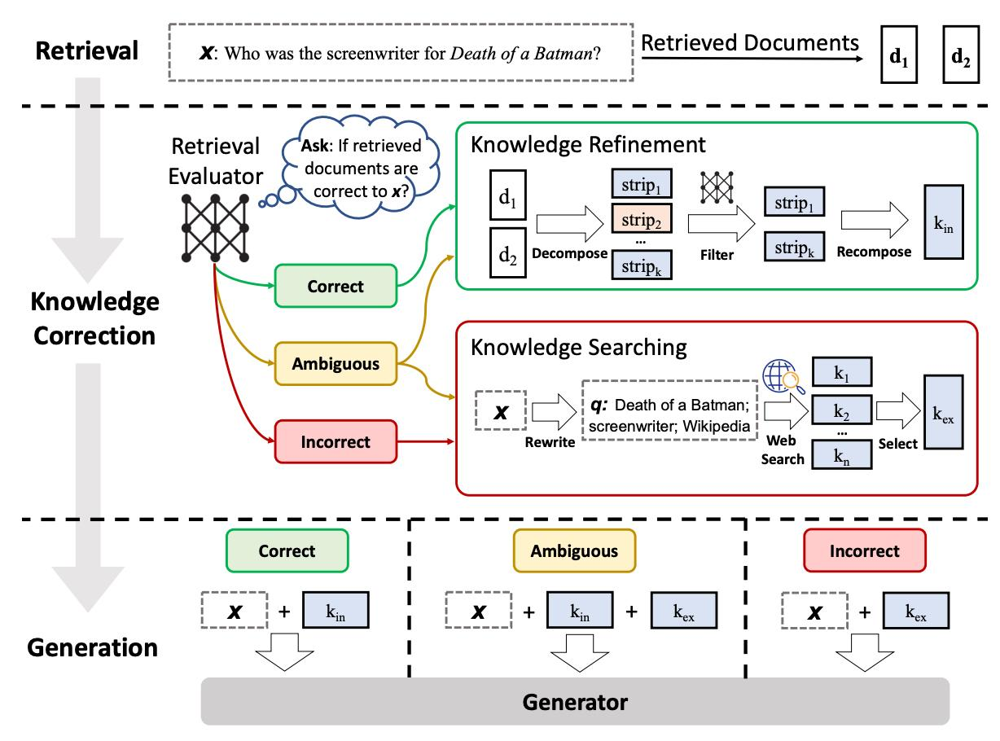

# Corrective RAG (CRAG) using LangGraph

## 📌 Project Overview

This project is an implementation of **Corrective RAG (CRAG)** built from scratch using **LangGraph**. It is based on the research paper architecture and solves a major flaw in Traditional RAG systems.

---

## ⚠️ The Problem with Traditional RAG

In a traditional RAG system, there is a major risk of **hallucination** when the vector database returns irrelevant documents.

- **The Practical Example:** If we ask the system *"What is a Transformer in Deep Learning?"*, the local database (which only has older ML books) retrieves documents about MLPs, CNNs, and Regularization. The word "Transformer" is no where in the retrieved context.
- **The Problem:** Despite having completely irrelevant documents, the LLM still generates a perfectly correct answer. It does this by **ignoring the provided context** and digging into its own parametric knowledge (its internal training data).
- **Why this is dangerous:** While it worked for a general question like Transformers, in a real business scenario (like asking about a *"Company Leave Policy"*), the LLM will not have that parametric knowledge. If the retrieved documents are wrong, the LLM will simply **hallucinate and confidently give a wrong answer**.

Traditional RAG has **no mechanism** to stop the LLM from hallucinating when the retrieved documents are useless.

---

## 💡 The CRAG Solution

To fix this, CRAG introduces a **Retrieval Evaluator**. Instead of sending retrieved documents straight to the LLM, the evaluator **"grades"** each document (giving a score from 0 to 1) to check if it is actually relevant to the user's query.

Based on the evaluation scores (**Lower Threshold = 0.3**, **Upper Threshold = 0.7**), the system divides the flow into **Three Cases:**

### 1. ✅ The "Correct" Case — Score > 0.7

If at least one document is highly relevant, the system trusts the database.

- **Action:** Performs **Knowledge Refinement**
- **How it works:** Because of text chunking, a retrieved document might contain some useless paragraphs. The system:
  1. Decomposes the document into individual sentences
  2. Filters out the irrelevant sentences
  3. Recombines the good ones into a **Refined Context** before generating the final answer

### 2. ❌ The "Incorrect" Case — All Scores < 0.3

If none of the documents are relevant, the system knows the local database cannot answer the question.

- **Action:** Performs a **Web Search**
- **How it works:**
  1. Performs a **Query Rewrite** (e.g., *"recent AI news"* → *"recent AI news last 30 days"*)
  2. Uses the **Tavily API** to search the web
  3. Runs web results through **Knowledge Refinement**
  4. Generates the final answer

### 3. 🔀 The "Ambiguous" Case — Scores between 0.3 and 0.7

If the documents are partially relevant but not perfect, the system uses a mix of both.

- **Action:** Combines **Internal and External** knowledge
- **How it works:**
  1. Takes the "Good Docs" (scores > 0.3) from the local database
  2. Performs a **Web Search** to gather missing external information
  3. Combines both sets of documents, refines them, and generates the final comprehensive answer

---

## 🛠️ Tech Stack

| Tool | Purpose |
|------|---------|
| **LangGraph** | Build routing nodes and state management (Graph architecture) |
| **LangChain** | Chaining prompts and models |
| **OpenAI (ChatOpenAI)** | Evaluation, filtering, query rewriting, and final generation |
| **FAISS** | Local vector database to store the ML/DL PDF books |
| **Tavily API** | External web search when local documents fail |

---

## 🗺️ Architecture Diagram

---
